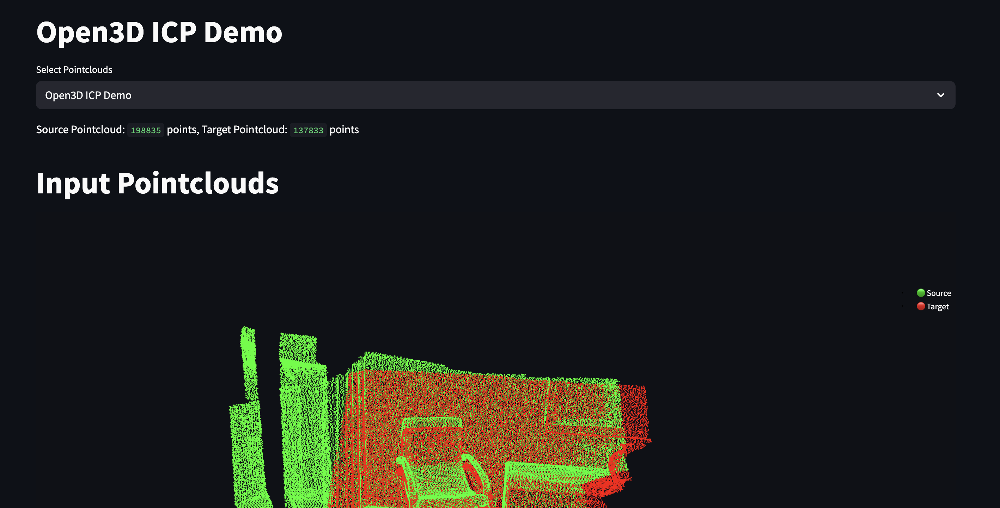

# icp-demo
Deployable Streamlit app showing ICP pointcloud registration demo with Open3D library

### Installation
```bash
pip install -r requirements.txt
```
### Run the app
```bash
streamlit run streamlit_app.py
```
### Open the app
Open your browser and go to `http://localhost:8501` to view the app:
